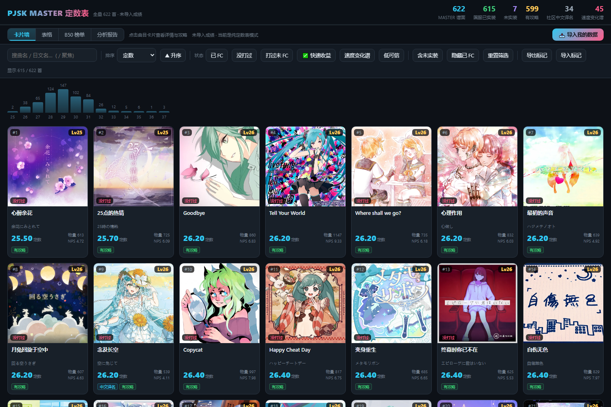

# PJSK 国服 MASTER 定数表 · 未 FC 攻略工具

一张网页，看**全量 MASTER 曲目**的社区定数、难点攻略，外加**你自己账号**的进度：
已 FC / 打过未 FC / 没打过、快速收益、B50 榜单、苦手分析、水平报告。

**在线地址：<https://va1zmmmmm.github.io/pjsk-teishu/>**



## 它是什么

- **定数表 / 攻略库**（不需要登录、不需要上传）：国服 MASTER 谱面 622 首，社区定数、BPM、物量、NPS 密度、
  中文难点攻略（译自 pjsekai.com 的「楽曲難易度表 MASTER」），9 种排序 + 关键词搜索 + 星级/要素筛选。
- **你的成绩分析**（导入一次即可）：把 haruki 导出的 suite JSON 拖进来，网页会立刻算出
  四状态筛选、快速收益清单、B50 榜单 + 提升空间、苦手/擅长要素分析、水平报告。
- **手动维护**：没有抓包数据也能用 —— 在曲目详情里手动标记「已 FC」、记游玩次数（会自动修正个人定数），
  照样出 B50 与分析。

**所有计算都在你的浏览器里完成。**数据存在浏览器本地（localStorage），不上传、不联网、没有后端。

## 怎么导入自己的数据

1. 打开 <https://haruki.seiunx.com>，登录并把你的游戏账号数据同步/上传一次（这就是你的成绩快照）。
2. 拿到那份 suite JSON，两种办法任选其一：
   - 打开你账号的公开数据地址，右键「另存为」保存成 `.json`：

     ```
     https://toolbox-api-cdn.haruki.seiunx.com/public/cn/suite/<你的游戏UID>
     ```

     （`cn` 换成 `jp` / `tw` / `kr` 对应其它服）
   - 或者在 haruki 页面按 `F12` → Network → 找到返回 suite 数据的请求 → 右键「Copy response」→
     粘进记事本存成 `.json`
3. 回到本工具，点右上角 **「📥 导入我的数据」**，选中那个 `.json`（约 5 MB 属正常）。

导入成功后工具栏会显示 **数据快照时间**，随时可以「清除已导入的数据」。
解析失败会给中文报错（不是 suite 文件 / JSON 被截断 / 空数据都会分别提示）。

> 快照不是实时的：游戏里打出新成绩后，要去 haruki 那边重新同步一次再导一次。

## 手动维护（不导入也能用）

- 点任意曲目打开详情 → **「我的数据」**：`−/+` 记游玩次数，或标记「已 FC」
- **个人定数** = 社区定数 + 0.01 ×（该曲多打的次数），直接显示在卡片/表格的定数上（金色角标），
  社区原值在表格「社区定数」列和详情弹窗里都能看到
- 这些标记只存在本机浏览器里，换浏览器/设备用工具栏的 **「导出标记」** 存成 JSON 再导入

## 口径说明

| 项 | 口径 |
|---|---|
| 四状态 | 只看 MASTER 难度。已 FC = 有 `full_combo`/`full_perfect` 记录（或你手动标记）；打过未 FC = 有成绩没 FC；没打过 = 无记录；未实装 = 国服已排期未上线（默认隐藏） |
| 快速收益 | 没打过 且 已实装 且 定数 ≤ 你的 FC 上限 + 0.3（FC 上限 = 你已 FC 曲目里的最高定数） |
| B50 | 算法 A 套（源自 Uni-PJSK-Viewer）：只算 FC/AP，`score = 定数 + (AP ? 1.5 : 0)`，rating = 前 50 之和 ÷ 50 |
| 提升空间 | 打过未 FC 且定数高于 B50 榜尾门槛的曲子 —— FC 掉就能进榜 |
| 苦手 / 擅长 | 取你**打过**的曲子，按定数每 0.5 一档分层，用**留一法**算每首的基线 FC 率（避开自身），再对每个要素做「期望 FC 数 vs 实际 FC 数」的 z 检验；样本 < 10 首的要素不列入 |

定数来源：源2 = pjsekai.com 日服 8 档难度分类 → 伪定数（官方星级 + 档内位置）；
源C = 同星级内「物量排名 + NPS 排名」/2 复合，仅 8 档缺时兜底（标「低可信」）。

## 数据来源与致谢

| 来源 | 用途 |
|---|---|
| [pjsekai.com](https://pjsekai.com/)「楽曲難易度表 MASTER」 | 日服 8 档难度分类、要素标签、難所攻略（本仓库译文为其衍生） |
| [sekai.best](https://sekai.best/) | 歌曲封面静态资源（`storage.sekai.best`，国服优先、日服兜底） |
| [萌娘百科](https://zh.moegirl.org.cn/) 音乐游戏用语 / 歌曲表 | 社区中文译名、BPM 与时长、音游术语口径 |
| [haruki.seiunx.com](https://haruki.seiunx.com/) | 玩家成绩数据（suite）导出 |
| haruki-sekai-sc-master | 国服 master 数据（曲目 / 谱面 / 星级 / 物量） |

## 开发者：本地怎么跑

纯静态单文件，不需要构建工具：

```bash
git clone https://github.com/Va1zmmmmm/pjsk-teishu.git
cd pjsk-teishu
# web/index.html 已经构建好了，双击即开（file:// 直接能跑，无服务器、无依赖）
```

页面结构、样式、全部 JS 都在 **`web/_template.html`**（`gen_web_view.py` 把数据注入 `/*__PAYLOAD__*/`
占位符生成 `web/index.html`）。仓库**不附带**注入数据所需的中间产物 `master_all.json` ——
它是用账号成绩数据生成的，按下面的「从头重建」自己产一份即可。

`web/index.html` 是自包含单文件（模板 + 数据 + JS/CSS）。
个人计算全部是浏览器端 JS，核心是 `aggregateSuite()`（聚合 suite 成绩）和
`buildAnalysis()`（B50 / 提升空间 / 苦手分析 / 水平报告），两者都不依赖 DOM，可以直接在控制台里调用：

```js
aggregateSuite(await (await fetch("你的suite.json")).json())   // → 每首曲子的 fc/ap/hs 状态
```

`data/` 里只有**公开数据**（国服 master、日服难度分类、萌百 BPM/译名、术语表、攻略原文与译文）。

要**从头重建**数据集（可选，需要你自己的账号数据）：

```bash
export HARUKI_EMAIL=... HARUKI_PASSWORD=... HARUKI_UID=...
python pipeline/haruki_pipeline.py --both      # 拉你的 suite + 合并成 CSV
python pipeline/parse_pjsekai_8level.py        # 以下按 CLAUDE 里的顺序跑
python pipeline/parse_pjsekai_tips.py
python pipeline/parse_moegirl_bpm.py
python pipeline/parse_moegirl_names.py
export LLM_API_KEY=...                         # translate_tips 需要一个 OpenAI 兼容接口
python pipeline/translate_tips.py
python pipeline/calc_nps.py
python pipeline/fix_sourceC_composite.py
python pipeline/merge_teishu_sources.py
python pipeline/annotate_names_release.py
python pipeline/build_master_all.py            # ⚠️ 产出的是「你的」master_all.json（含个人成绩，别提交）
python pipeline/gen_web_view.py --public       # → web/public/index.html
cp web/public/index.html web/index.html        # 覆盖发布用的那份
```

> `pipeline/` 里的脚本没有第三方依赖（纯标准库）。凭据只从环境变量或 `pipeline/credentials.json` 读，
> 后者已在 `.gitignore` 里。**注意**：`build_master_all.py` 产出的 `master_all.json` 包含你的个人成绩，
> `.gitignore` 已排除，分发前请再确认一次。

## 免责声明

本项目是**非官方同人工具**，与 SEGA / Colorful Palette 无任何关联。
《プロジェクトセカイ カラフルステージ！ feat. 初音ミク》的游戏素材（曲名、曲目封面等）版权归
SEGA / Colorful Palette 及各权利人所有，此处仅用于玩家之间的信息交流。

定数是**社区主观数据**，不同玩家手感不同；本工具的排序、B50、苦手分析都只是参考，不代表官方评价。
数据会随版本更新而变化，页面数据为某次快照，可能滞后。

## License

MIT —— 见 [LICENSE](LICENSE)。
